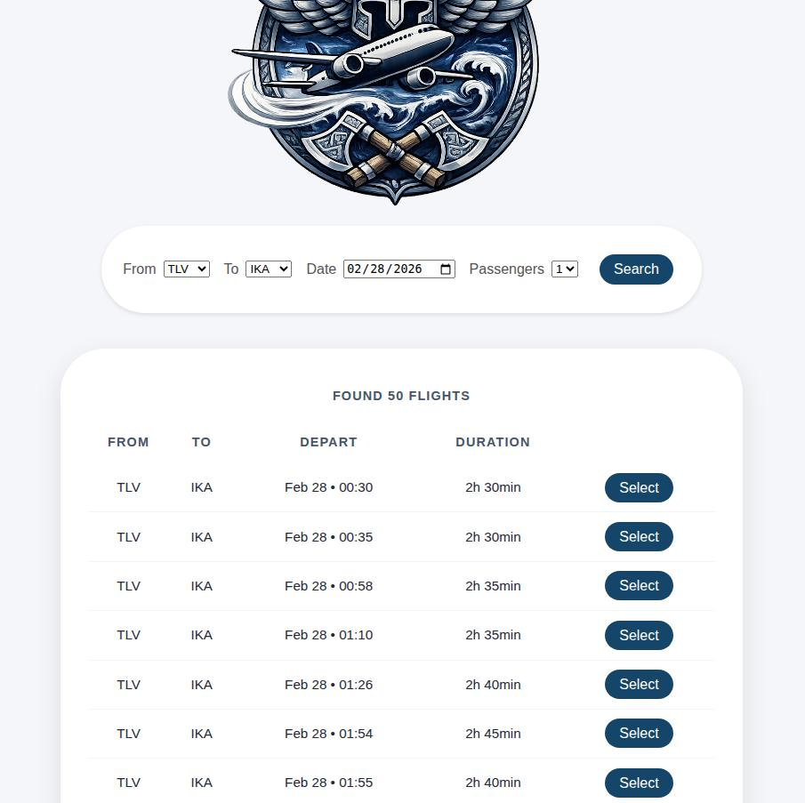
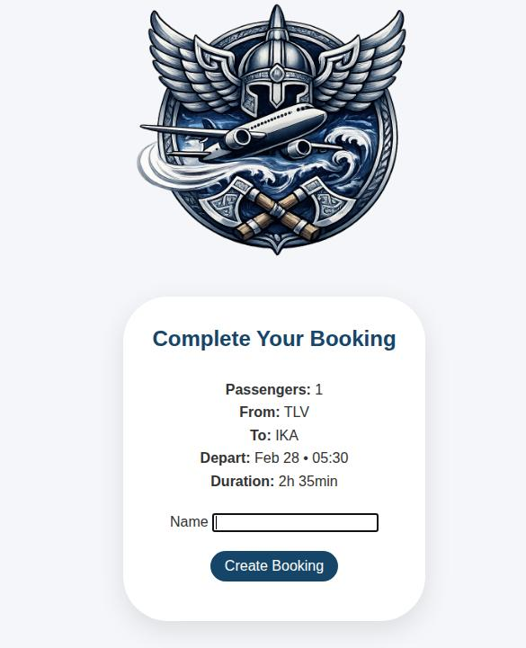
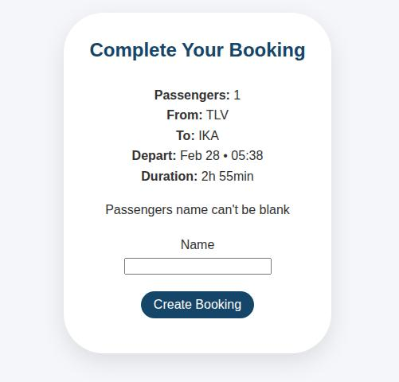
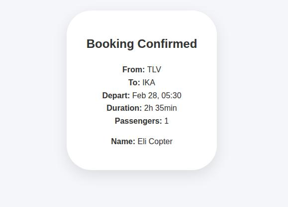

# Flight Booker

A simple flight booking application built with Ruby on Rails as part of The Odin Project curriculum.

Users can search for flights between airports, select a flight, and create a booking for one or more passengers.

---

## Features

- Search flights by departure airport, arrival airport, and date
- Display available flights ordered by departure time
- Select a flight and create a booking
- Support multiple passengers per booking
- Passenger name validation
- Booking confirmation page

---

## Screenshots

### Flight search

### Search results

### Booking form

### Validation example

### Booking confirmation

